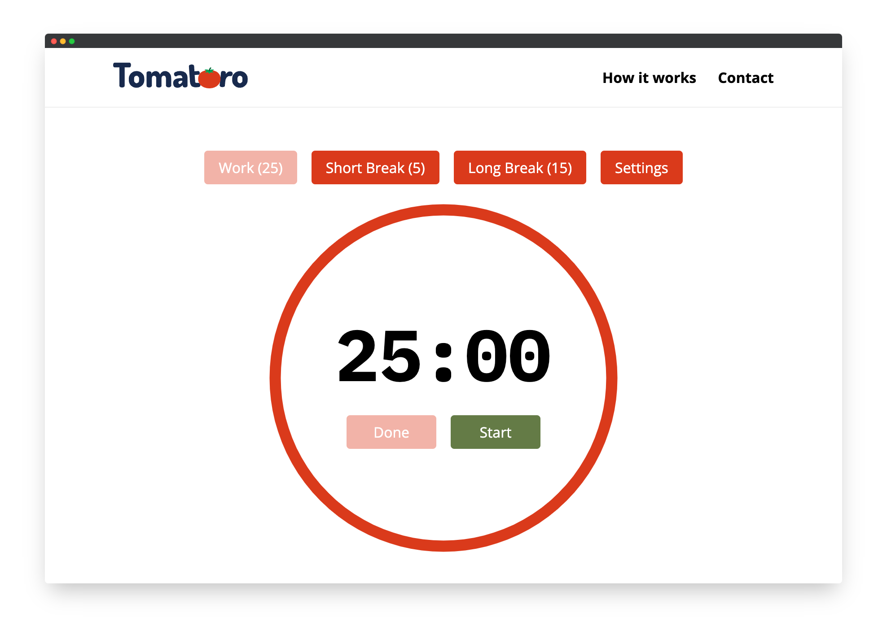

# Tomatoro

Time management tool based on [Pomodoro Technique](https://en.wikipedia.org/wiki/Pomodoro_Technique).

## Features

- ⏳ Time accuracy
- 🔔 Alerts/Notifications
- ⚙️ Customizable work/break time
- 🏕️ Settings saved in your session
- 👀 Timer in menu bar
- 🎨 Minimalistic design
- ⚡️️ ~~Quick actions from your notifications~~ (coming soon)

## Development

This is a [Next.js](https://nextjs.org/) project bootstrapped
with [`create-next-app`](https://github.com/vercel/next.js/tree/canary/packages/create-next-app).
The most used commands are:

* `npm run dev` - Build and start the app in dev mode at http://localhost:3000
* `npm run test` - Run the tests
* `npm run lint` - Lint the code

Husky is used to run lint and tests before commit, so you don't need to worry about it. It also increases the version
number in `package.json` and `package-lock.json` automatically.

If you want to skip it, use `git commit --no-verify`. We recommend you to not do it.

## Roadmap

This schedule is not final and will change in time:

- **v3.0** (in progress...) - Complete rework
- **v3.1** (2023) - Dark theme
- **v3.2** (2023) - Multi-language support (ES, EN)
- **v3.3** (2023) - User accounts
- **v3.4** (2023) - Tasks
