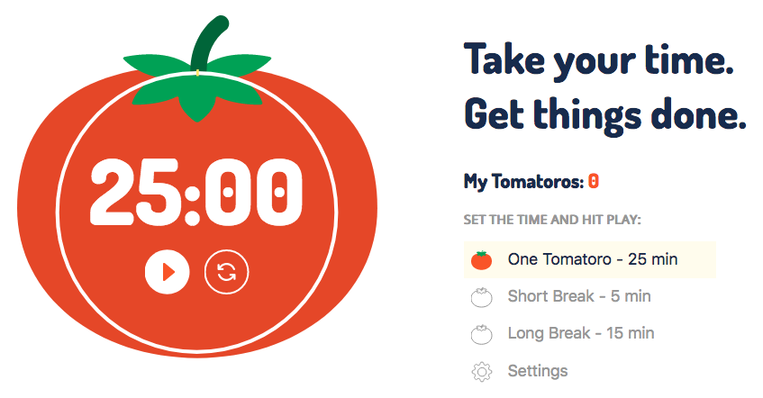

# Tomatoro

Time management tool based on [Pomodoro Technique](https://en.wikipedia.org/wiki/Pomodoro_Technique).

## Features

- Alerts/Notifications
- Customizable work/break time
- Settings saved in your session
- Minimalistic design
- Timer in menu bar

## Development

This app uses [Create React App](https://github.com/facebook/create-react-app). The most used commands are:

* `yarn start` - Build and start the app in dev mode at http://localhost:3000
* `yarn test` - Run the tests

If you want to  contribute, please run all tests before creating a PR.

## License

MIT © [Tony Mtz](http://tonymtz.com)
